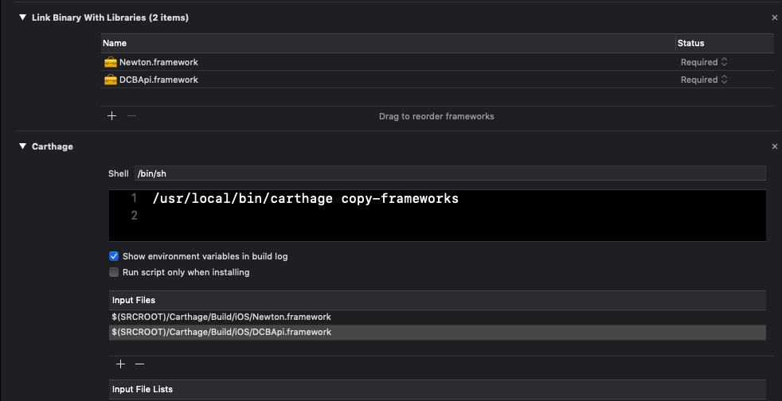

# Direct Carrier Billing by Digital Virgo


[](https://github.com/Carthage/Carthage)

Documentation and example of Digital Virgo Direct Carrier Billing.

Following this guide your app will be technically enabled to be promoted and integrated with Digital Virgo mobile payment.

After the integration of the sdk the resultant app can check if the user coming from Digital Virgo acquisition (optionally with explicit login with msdisdn+pin) and can check expiration date and several information.

## Requirements
- iOS Deployment Target: 9.0
- Swift 5.5(only)

## Clone and Try it

Clone it and download the dependency with [Carthage](https://github.com/Carthage/Carthage) . Run on terminal this command in the root folder where is the project DCBApplication.xcodeproj

`carthage update`

If you are only interested to download the framework for a specific platform run the code below: (e.g. iOS)

`carthage update --platform iOS`

## Installation on your Project

Create cartfile, if there isn't,  and add this to `Cartfile`

```
binary "https://dvs-devtools.github.io/DcbSdk/ios/carthage-newton-ios-sdk.json"
binary "https://dvs-devtools.github.io/DcbSdk/ios/carthage-dcbapi-ios-sdk.json"
```

Run the following command in terminal

`carthage update`

If you are only interested to download the framework for a specific platform run the code below: (e.g. iOS)

`carthage update --platform iOS`

Then, you need to create a run script to support Carthage. Therefore, go to `Build Phases` of your Target and create a `New Run Script Phase`. 
After this step, please copy information shown in the image below.



To speed up the process, simply copy the input files below

```
$(SRCROOT)/Carthage/Build/iOS/Newton.framework
$(SRCROOT)/Carthage/Build/iOS/DCBApiExt.framework
```
Please make sure the two frameworks are linked as seen in the image.

## If Aquisition process is hosted completely by Digital Virgo 
To use Direct Carrier Billing when all acquisition flow is managed by Digital Virgo use the following code:
```swift
let client = DCBApiClient(baseDomain:"<FINGERPRINT_DOMAIN>",
                          confInfoDomain: "<SERVICE_DOMAIN>",
                          apikey: "<YOUR_APIKEY>",
                          catalog: "<YOUR_CATALOG>",
                          country: "<YOUR_COUNTRY>",
                          namespace: "<YOUR_NAMESPACE>")

DCBUserManager(client: client).checkFlowDCB(isActive: false) { date in
    if let dcbUser = DCBUserManager.dcbUser {
        //User is recognised as Digital Virgo Acquisition​​
​
​       if let date = date {
​           //User is subscribed​
​       } else {
​           //User expired, not subscribed​​
​           //user must pay again to access the product​​
​       }
​   } else {
​       //Normal user discover the app from AppStore​
​   }
}
```
## If Aquisition is done by a third party and managed by Newton
To use Direct Carrier Billing when there is only a "Newton" managed subscription, use the following code:

```swift
let client = DCBApiClient(baseDomain:"<FINGERPRINT_DOMAIN>",
                          confInfoDomain: "<SERVICE_DOMAIN>",
                          apikey: "<YOUR_APIKEY>",
                          catalog: "<YOUR_CATALOG>",
                          country: "<YOUR_COUNTRY>",
                          namespace: "<YOUR_NAMESPACE>")

DCBUserManager(client: client).checkFlowUserRecognition() { date, errorMessage in
​       if let date = date {
​           //User is subscribed​
​       } else {
​           //User expired, not subscribed​​
​           //user must pay again to access the product​​
​       }
​   } else {
​       if let error = errorMessage {
​         print(error)
​       }
​       //Normal user discover the app from AppStore​
​   }
}
```

## Conclusion
Hooray! You've finished the integration!    

For further assistance, please get in touch with the Team by dropping an email to dvs-apps@digitalvirgo.com

